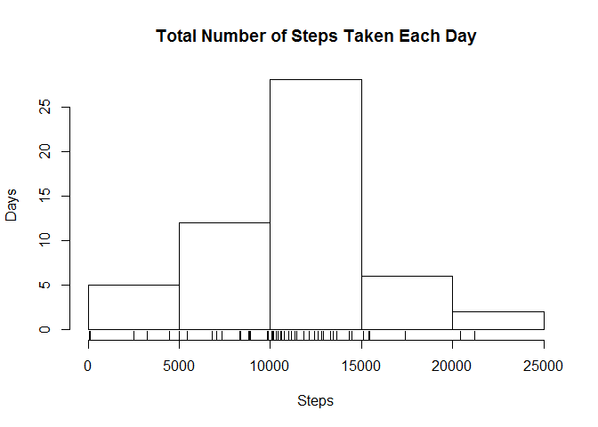
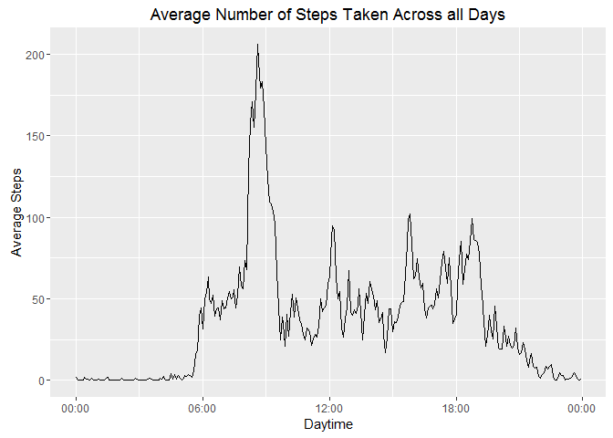
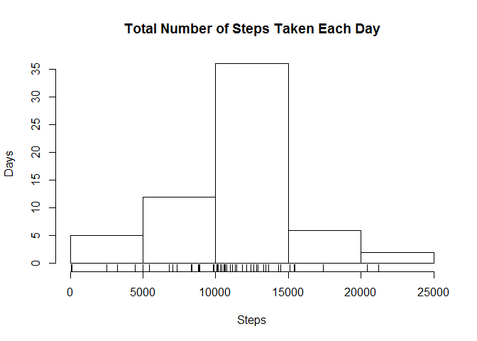
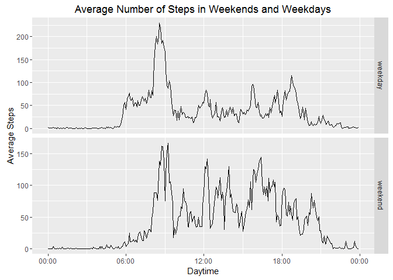

# Reproducible Research: Peer Assessment 1


## Loading and preprocessing the data

Reading data from **activity.csv** file, which contains steps taken by someone during a period of 2 months.


```r
# Prevent Scientific Notation
options(scipen=999, digits = 2)

#Read the data
raw_data <- read.csv("activity.csv")

# Ignore NA´s
data <- raw_data[!is.na(raw_data$steps), ]

# Load dplyr package
library(dplyr)
# Summarize daily number of steps
clean_data <- data %>% 
    group_by(date) %>% 
    summarize(daily_steps = sum(steps)) %>% 
    as.data.frame()
```


## What is the mean total number of steps taken per day?

Ploting the histogram of the mean total number of steps taken per day:

```r
# Ploting the histogram
hist(clean_data$daily_steps, main = "Total Number of Steps Taken Each Day", 
     xlab = "Steps", ylab = "Days")
rug(clean_data$daily_steps)
```

<!-- -->

Calculate the **mean** and the **median** of the total number of steps taken per day:

```r
# Report the mean and median of daily steps
mean_steps <- mean(clean_data$daily_steps)
median_steps <- median(clean_data$daily_steps)
```
The **mean** and **median** of the total number of steps taken per day is **10766.19** and **10765**, respectively. 

## What is the average daily activity pattern?

Time series plot of the 5-minute interval (x-axis) and the average number of steps taken, averaged across all days (y-axis). 

```r
# Average the data by interval across all days
av_integer_interval <- data %>% 
    group_by(interval) %>% 
    summarise(steps = sum(steps)/n()) %>%
    as.data.frame

av_interval <- av_integer_interval %>%
    mutate(interval = substring(as.character(interval + 10000), 2)) %>%
    mutate(interval = as.POSIXct(interval, format = "%H%M")) %>%
    as.data.frame

# Plot the result in a Time Series Plot
library(ggplot2)
library(scales)
ggplot(av_interval, aes(interval, steps)) + 
    geom_line() + 
    scale_x_datetime(labels = date_format("%H:%M", tz = "America/Sao_Paulo")) +
    xlab("Daytime") +
    ylab("Average Steps") +
    ggtitle("Average Number of Steps Taken Across all Days")
```

<!-- -->

Calculate the **interval** of the maximum average steps:

```r
max_steps_interval <- as.character(arrange(av_interval, desc(steps))[1, "interval"], format = "%H:%M")
```

The **interval** of the maximum average steps taken is at **08:35**. 

## Imputing missing values

There are a number of days/intervals where there are **missing values**. 

Calculating the total number of **rows** with missing values.

```r
na_rows <- sum(!complete.cases(raw_data))
```
The total number of **rows** with missing values is **2304**.

**Strategy to fill the missing values**: when there is a missing value, fill it with the *mean of that 5-minute interval*.


Creating the new data frame:

```r
filled_data <- raw_data %>% 
    mutate(steps = ifelse(is.na(steps), 
            as.integer(av_integer_interval[match(interval, av_integer_interval$interval), "steps"]), 
            steps)) %>% 
    as.data.frame
```

## What is mean total number of steps taken per day, calculated with the new data frame with missing values filled in?

Ploting the histogram of the mean total number of steps taken per day, calculated with the new data frame:


```r
# Summarize daily number of steps
clean_filled_data <- filled_data %>% 
    group_by(date) %>% 
    summarize(daily_steps = sum(steps)) %>% 
    as.data.frame()
# Ploting the histogram
hist(clean_filled_data$daily_steps, main = "Total Number of Steps Taken Each Day", 
     xlab = "Steps", ylab = "Days")
rug(clean_filled_data$daily_steps)
```

<!-- -->

Calculating the **mean** and **median** total number of steps taken per day:


```r
# Report the mean and median of daily steps
mean_steps <- mean(clean_filled_data$daily_steps)
median_steps <- median(clean_filled_data$daily_steps)
```
The **mean** and **median** of the total number of steps taken per day is **10749.77** and **10641**, respectively.

## Are there differences in activity patterns between weekdays and weekends?

Ploting the Time Series Plot based on Weekday factor (Weekday or Weekend):


```r
# Create a new column with the "weekday" or "weekend" factor.
weekend <- c("sábado", "domingo", "Saturday", "Sunday")
weekend_data <- filled_data %>%
    mutate(Weekday = weekdays(strptime(date, format = "%Y-%m-%d"))) %>%
    mutate(Weekday = ifelse(is.na(match(as.character(Weekday), weekend)), "weekday", "weekend")) %>%
    mutate(Weekday = as.factor(Weekday)) %>%
    as.data.frame()

# Average the data by interval and weekday factor across all days
av_integer_interval <- weekend_data %>% 
    group_by(interval, Weekday) %>% 
    summarise(steps = sum(steps)/n()) %>%
    as.data.frame

av_interval2 <- av_integer_interval %>%
    mutate(interval = substring(as.character(interval + 10000), 2)) %>%
    mutate(interval = as.POSIXct(interval, format = "%H%M")) %>%
    as.data.frame

# Create the Time Series Plot based ond Weekday factor
ggplot(av_interval2, aes(interval, steps)) +
    geom_line() + facet_grid(Weekday ~ ., scales = "free") +
    scale_x_datetime(labels = date_format("%H:%M", tz = "America/Sao_Paulo")) +
    xlab("Daytime") +
    ylab("Average Steps") +
    ggtitle("Average Number of Steps in Weekends and Weekdays")
```

<!-- -->


